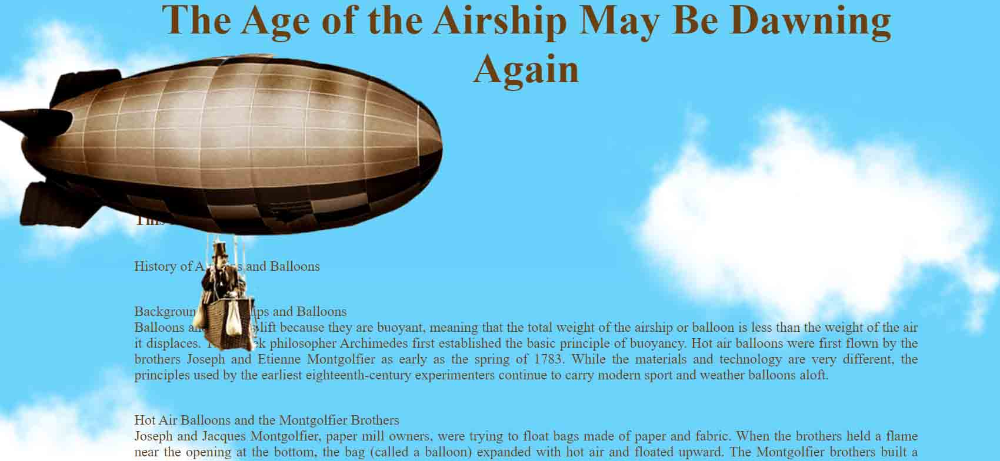

# Example of Responsive web design 

Parallax effect project in react. 
Airship Blog. parallax-effect, react, sass/scss.

parallax-effect, react, sass/scss, svg.


### Getting Started with Create React App

This project was bootstrapped with [Create React App](https://github.com/facebook/create-react-app).


### Installation

1. Clone the repo
```
git clone https://github.com/janix374/parallax-effect.git
```
2. Install NPM packages
```
npm install
```
3. Start project 
```
npm start
```
4. Build the app for production to the build folder
```
npm build
``` 

